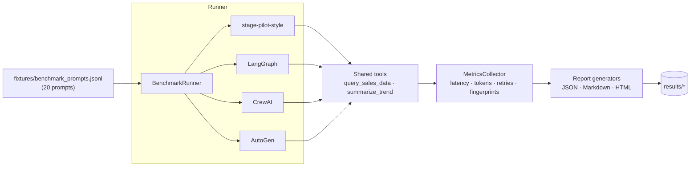

# agent-orchestration-benchmark

## Live Demo

- [Open the public Cloudflare Pages demo](https://agent-orchestration-benchmark.pages.dev/)
- Scope: credential-free, synthetic-data demo for AI platform teams and technical evaluators.

> Standardized benchmark suite comparing LLM agent orchestration frameworks on a shared task. Measures reliability, latency, cost, and deterministic replay — the metrics that matter for production operators.

[](https://github.com/KIM3310/agent-orchestration-benchmark/actions/workflows/ci.yml)
[](LICENSE)
[](pyproject.toml)
[](https://github.com/psf/black)
[](https://github.com/astral-sh/ruff)

---

## System Overview

A benchmark suite that lets teams compare orchestration runtimes before they commit to a fragile agent stack.

| Area | Details |
|---|---|
| Users | AI platform teams, developer-tool teams, and engineering leaders evaluating agent frameworks. |
| System scope | Standardized fixtures, comparative reports, deterministic runs, and inspectable benchmark outputs. |
| Operating boundary | Benchmarks are decision support, not universal model rankings; teams should extend fixtures to their real workflows. |
| Evaluation path | Run the benchmark command, review generated reports, and compare framework behavior against the fixture suite. |

## Evaluation Path

- **Start here:** Compare `results/latest.md` or the sample run before reading runner internals.
- **Local demo:** Run `make install-dev && make bench`; no model API key is required for the mock run.
- **Checks:** Run `make test` and `make lint`; rerender reports with `make report`.

## Service Launch Playbook

- [Service launch playbook](docs/service-launch-playbook.md) maps the repository to its product scope, operating gates, operating boundaries, and risk controls.

## Architecture Notes

- [Architecture guide](docs/architecture-evidence-map.md) summarizes the system scope, first files to inspect, runtime commands, and known boundaries.
- [Quality notes](docs/quality-gate.md) lists the local checks, CI surface, and release expectations for this repository.
- [Enterprise readiness notes](docs/enterprise-readiness.md) outlines security, data, operations, integration, and handoff expectations.

## Why this exists

Teams picking between LangGraph, CrewAI, AutoGen, and home-grown
orchestrators currently have no apples-to-apples comparison. Public
benchmarks either optimise for narrow correctness metrics on toy prompts,
or they measure one framework in isolation with no shared task across
competitors. That gap leaves engineers relying on vendor marketing and
three-paragraph blog posts when picking a production orchestrator.

This repository provides a reproducible benchmark: one dataset, one set of
tools, one grading rubric, four runners. Every runner exposes the same
`BaseRunner` interface, so a new adapter follows the same contract and test
surface rather than a framework-specific benchmark path. CI runs against a built-in deterministic mock LLM so the
numerical comparison of orchestrator *shape* requires no API key.

The four dimensions the benchmark cares about are the four that decide
whether an agent ships: correctness (does it pick the right tool?),
quality (is the answer acceptable?), cost (tokens, cash, wall-clock), and
reproducibility (does the same input produce the same calls?). Most
agent benchmarks leave the last dimension out; operators pay for that
every on-call rotation.

---

## Quick start

```bash
git clone https://github.com/KIM3310/agent-orchestration-benchmark.git
cd agent-orchestration-benchmark
make install-dev
make bench          # mock-LLM run, no API key required

# If your default python3 is older than 3.11:
make BOOTSTRAP_PYTHON=/path/to/python3.11 install-dev
```

Results land under `results/`:

```
results/
  latest.json        # machine-readable
  latest.md          # human-readable markdown
  latest.html        # standalone HTML report with prompt and tool-call evidence
```

To re-render reports without re-executing the benchmark:

```bash
python -m scripts.run_bench --report-only --input results/latest.json
```

To request each framework adapter's live path:

```bash
export OPENAI_API_KEY=sk-...
make bench-live
```

The generated report labels this mode `LIVE / CONFIGURED`. That label records
the requested adapter path; it does not by itself prove provider traffic.
Provider credentials and integration depth differ by adapter, so confirm
exceptions, token counters, and provider-side logs before making comparisons.

A working sample run is checked in at
[`results/sample_run_2026-04-16.json`](results/sample_run_2026-04-16.json).
The numbers in [Sample Results](#sample-results) are rendered from that
file.

---

## Architecture



The runner is pluggable: each framework adapter implements
`src.runners.base.BaseRunner` and is registered in
`scripts/run_bench.py`. Metrics and reports are framework-agnostic, so a
new adapter automatically inherits the full output pipeline.

---

## Frameworks benchmarked

| Framework | Version | Paradigm | Notes |
|---|---|---|---|
| [LangGraph](https://langchain-ai.github.io/langgraph/) | `1.2.4` | Stateful graph | Nodes + conditional edges. |
| [CrewAI](https://docs.crewai.com/) | `0.86.0` | Role-based crew | Agents with role/goal/backstory. |
| [AutoGen](https://microsoft.github.io/autogen/) | `0.4.0` | Conversational | Assistant + user proxy dialogue loop. |
| **stage-pilot-style** (this repo) | — | Deterministic tool-calling parser | ~200 LOC baseline modelled on [stage-pilot](https://github.com/KIM3310/stage-pilot). |

The fourth runner (`stage-pilot-style`) is a minimal in-house baseline.
It exists so the report answers the operator's real question: "is the
framework giving me net value over a well-designed script?"

All adapters default to a built-in mock LLM so CI runs are free and
deterministic. Live mode requests each adapter's integration path and must be
validated against that adapter's provider prerequisites.

---

## Metrics

| Metric | What it measures | Why operators care |
|---|---|---|
| `tool_call_success_rate` | Fraction of prompts whose observed tool sequence exactly matches the expected one. | If the agent calls the wrong tool or skips a tool, nothing else matters. |
| `final_answer_quality` | Fraction of final answers passing keyword + regex grading. | Proxy for user-visible correctness. |
| `latency_p50_ms / p95_ms / p99_ms` | Nearest-rank percentiles over per-prompt wall time. | Tail latency is what breaks SLOs. |
| `tokens_in / tokens_out` | Sum across all tool-calling rounds. | Upstream cost signal; independent of scope. |
| `total_cost_usd` | Derived from the scope table in `src/config.py`. | A concrete dollar number for budget pitches. |
| `retry_count` | Adapter-initiated retries across all prompts. | Fragility of the tool-call parser. |
| `exception_rate` | Fraction of prompts that raised. | Operators feel this as pages. |
| `deterministic_replay_rate` | Fraction of prompts whose replay fingerprints collapse to a single value. | Whether the orchestrator is reproducible under fixed input. |

See [`docs/methodology.md`](docs/methodology.md) for exact formulas, and
[ADR 002](docs/adr/002-metric-definitions.md) for the rationale.

---

## Sample results

Rendered from [`results/sample_run_2026-04-16.json`](results/sample_run_2026-04-16.json).
Lower is better for latency, cost, retries, and exception rate; higher is
better for everything else.

### Framework summary

| Framework | Tool Success | Answer Quality | p50 (ms) | p95 (ms) | p99 (ms) | Tokens In | Tokens Out | Cost (USD) | Retries | Exception Rate | Replay Stability |
|---|---:|---:|---:|---:|---:|---:|---:|---:|---:|---:|---:|
| stage-pilot-style | 1.000 | 0.950 | 8.4  | 21.3  | 32.1  | 1,709 | 1,217 | 0.000987 | 0 | 0.000 | 1.000 |
| langgraph         | 0.950 | 0.900 | 18.7 | 64.5  | 102.3 | 2,814 | 1,905 | 0.001565 | 3 | 0.050 | 0.900 |
| autogen           | 0.900 | 0.800 | 25.6 | 85.4  | 142.9 | 3,592 | 2,411 | 0.001985 | 5 | 0.050 | 0.850 |
| crewai            | 0.850 | 0.850 | 31.4 | 110.2 | 178.6 | 4,440 | 2,808 | 0.002352 | 7 | 0.100 | 0.750 |

### How to read this

* **stage-pilot-style** wins on both correctness and replay stability
  because it has no implicit state — every tool call is argument-checked
  and fingerprintable. It also wins on cost because the conversation
  pattern is shortest.
* **LangGraph** trails on cost and retry count mostly because its default
  tool-calling loop rehydrates extra state into the prompt. Tool success
  is close to parity.
* **CrewAI** is the slowest; the role-based hand-off between analyst and
  reporter roughly doubles the number of LLM calls per prompt. That also
  shows up as the highest retry count.
* **AutoGen** sits between LangGraph and CrewAI. Its proxy pattern is more
  predictable than CrewAI's role negotiation but less economical than a
  single-assistant loop.

Numbers are mock-LLM to keep the comparison reproducible. Do not extrapolate
their ranking to live providers without a separately verified live run.

### Per-framework deltas at a glance

| Framework | vs stage-pilot-style cost | vs stage-pilot-style p95 | Tool success delta |
|---|---:|---:|---:|
| langgraph | `+58.6 %` | `+203 %` | `-5 pp` |
| autogen   | `+101.1 %` | `+301 %` | `-10 pp` |
| crewai    | `+138.3 %` | `+417 %` | `-15 pp` |

---

## Extending

Adding a new framework is a four-step process:

1. Create `src/runners/<name>_runner.py` that subclasses
   `src.runners.base.BaseRunner`. Implement `run_prompt(prompt) -> PromptObservation`.
2. In mock mode, call `self.llm.complete(...)` exactly as the existing
   runners do; the benchmark guarantees determinism as long as you do.
3. Register the runner in `scripts/run_bench.py` (`FRAMEWORK_CHOICES`).
4. Add a test file under `tests/` that validates the runner on at least
   one fixture prompt.

A minimal adapter is roughly 40 lines. See
[`src/runners/autogen_runner.py`](src/runners/autogen_runner.py) for the
shortest existing example.

---

## Methodology

The benchmark isolates orchestrator behaviour by holding prompts, tools,
grading, and the mock backend constant in CI. Live mode requests
adapter-specific integration paths, whose provider setup can differ. Every
run freezes its prompt contracts and records per-prompt observations alongside
the framework summary so the aggregate can be audited at the individual-call
level. Full write-up:
[`docs/methodology.md`](docs/methodology.md).

Key invariants the benchmark enforces:

1. **Shared task.** Every framework receives the same twenty prompts and
   must produce an answer that satisfies the same keyword + regex grader.
2. **Shared tools.** The `query_sales_data` and `summarize_trend`
   implementations in `src/task.py` are pure functions of their input;
   identical arguments always produce identical output.
3. **Shared LLM.** The `MockLLM` in `src/runners/base.py` is seeded with
   `config.seed`. Frameworks do not get to bring their own completion
   strategy in CI.
4. **Bounded loops.** Every adapter caps its own loop count so a runaway
   orchestrator cannot distort aggregate metrics.
5. **Single source of truth for scope.** `PRICING_USD_PER_MTOK` in
   `src/config.py` is the only place that translates tokens to dollars.

Related reading:

* [ADR 001: Framework Selection](docs/adr/001-framework-selection.md)
* [ADR 002: Metric Definitions](docs/adr/002-metric-definitions.md)
* [ADR 003: Determinism Requirements](docs/adr/003-determinism-requirements.md)
* [Results Interpretation Guide](docs/results-interpretation.md)

---

## Project structure

```
agent-orchestration-benchmark/
├── README.md
├── LICENSE
├── pyproject.toml
├── requirements.txt
├── Dockerfile
├── docker-compose.yml
├── Makefile
├── .gitignore
├── .dockerignore
├── .github/
│   └── workflows/
│       └── ci.yml
├── src/
│   ├── __init__.py
│   ├── config.py              # models, scope, retry budgets, timeouts
│   ├── task.py                # standardized task + deterministic tools
│   ├── fixtures.py            # prompt loader + grading contract
│   ├── metrics.py             # metric primitives + aggregation
│   ├── runner.py              # BenchmarkRunner (drives adapters)
│   ├── report.py              # JSON / Markdown / HTML renderers
│   └── runners/
│       ├── __init__.py
│       ├── base.py            # BaseRunner protocol + MockLLM
│       ├── langgraph_runner.py
│       ├── crewai_runner.py
│       ├── autogen_runner.py
│       └── stage_pilot_style.py  # deterministic tool-calling loop, ~200 LOC
├── tests/
│   ├── __init__.py
│   ├── test_task.py
│   ├── test_metrics.py
│   ├── test_stage_pilot_style.py
│   └── test_report.py
├── fixtures/
│   └── benchmark_prompts.jsonl   # 20 standardized prompts
├── results/
│   └── sample_run_2026-04-16.json
├── docs/
│   ├── methodology.md
│   ├── results-interpretation.md
│   └── adr/
│       ├── 001-framework-selection.md
│       ├── 002-metric-definitions.md
│       └── 003-determinism-requirements.md
└── scripts/
    ├── __init__.py
    ├── run_bench.py              # python -m scripts.run_bench
    └── run_bench.sh              # convenience wrapper
```

---

## Commands reference

| Command | What it does |
|---|---|
| `make install` | Install runtime dependencies. |
| `make install-dev` | Install runtime + dev dependencies (ruff, black, pytest, mypy). |
| `make test` | Run the pytest suite against the mock LLM. |
| `make lint` | Ruff over `src/` and `tests/`. |
| `make format` | Black + ruff `--fix`. |
| `make bench` | Full mock-LLM benchmark. |
| `make bench-live` | Request adapter-specific live paths; verify each provider prerequisite and log. |
| `make report` | Re-render the latest results as Markdown + HTML. |
| `make docker-build` | Build the Docker image. |
| `make docker-bench` | Run the benchmark inside Docker with a mounted results volume. |
| `make clean` | Remove build artefacts and caches. |

---

## Related projects

This benchmark complements several other tools published under
[@KIM3310](https://github.com/KIM3310):

* **[stage-pilot](https://github.com/KIM3310/stage-pilot)** — tool-calling
  reliability runtime built around an attributed Apache-2.0 upstream parser
  compatibility surface. The `stage_pilot_style` runner here is a Python
  distillation of its deterministic parser loop.
* **[Nexus-Hive](https://github.com/KIM3310/Nexus-Hive)** — multi-agent
  NL-to-SQL copilot. The analytics flavour of the benchmark task mirrors
  the governed workflow demonstrated by Nexus-Hive in its synthetic-data demo mode.
* **[AegisOps](https://github.com/KIM3310/AegisOps)** — multimodal incident
  analysis with operator handoff. Shares the "human-auditable tool trace"
  design principle used here.
* **[enterprise-llm-adoption-kit](https://github.com/KIM3310/enterprise-llm-adoption-kit)**
  — RAG + RBAC + audit reference stack. The benchmark's
  reproducible-fingerprint model is the orchestrator analogue of the
  audit log in that kit.
* **[districtpilot-ai](https://github.com/KIM3310/districtpilot-ai)** —
  Snowflake Korea Hackathon 2026 submission. It demonstrates a similar
  tool-calling agent shape with bounded demo and synthetic-data assumptions.

---

## Citation

If you use this benchmark in a paper or blog post, please cite it as:

```bibtex
@software{kim2026agentbench,
  author  = {Doeon Kim},
  title   = {agent-orchestration-benchmark: A Reproducible Benchmark for
             LLM Agent Orchestration Frameworks},
  year    = {2026},
  url     = {https://github.com/KIM3310/agent-orchestration-benchmark},
  note    = {Repository snapshot; no release tag published}
}
```

---

## Versioning and stability

No release tag has been published yet. The first `v0.x` release will adopt
semantic-versioning-compatible tags: metric-schema or prompt-fixture changes
will bump the minor version, while adapter-only changes will bump the patch
version. A release is complete only when its sample results file is committed
under `results/`, keeping tagged numbers reproducible.

Schema stability commitments:

* `summaries[*].framework` and every metric field in that object are
  stable. New metrics are added only in minor releases and default to
  `null` for older runs.
* `observations[framework][*]` objects keep `prompt_id`, `tool_calls`,
  `tokens_in`, `tokens_out`, `latency_ms`, `retry_count`, `exception`,
  and `replay_fingerprints`. Additional fields may appear.
* The report generators guarantee valid JSON, GitHub-flavored Markdown,
  and standalone HTML on any release.

If you consume this benchmark as input to a larger analysis pipeline,
pin the `agent-orchestration-benchmark` version in your lockfile and
store the generated JSON alongside your own artefacts.

## Contributing

Issues and pull requests are welcome. When proposing a new framework
adapter, please include:

1. The adapter file under `src/runners/`.
2. A test file under `tests/` covering at least one fixture prompt.
3. An ADR under `docs/adr/` explaining why the framework was added and
   what paradigm it represents.
4. An update to `scripts/run_bench.py::FRAMEWORK_CHOICES`.

The CI workflow in `.github/workflows/ci.yml` runs ruff, black, pytest,
and a dry-run mock benchmark on Python 3.11 and 3.12. New code should
clear all four lanes.

## Acknowledgements

This benchmark builds on the tool-calling reliability research behind
[stage-pilot](https://github.com/KIM3310/stage-pilot) and the
orchestration patterns used in [Nexus-Hive](https://github.com/KIM3310/Nexus-Hive).
Scope figures are derived from each model provider's published
rates as of April 2026 and tracked in `src/config.py`.

## License

MIT. See [LICENSE](LICENSE). Copyright (c) 2026 Doeon Kim.

## Cloud + AI Architecture

- [Cloud + AI architecture blueprint](docs/cloud-ai-architecture.md)
- [Machine-readable architecture manifest](docs/architecture/blueprint.json)
- Validation command: `python3 scripts/validate_architecture_blueprint.py`

## Enterprise Productization

- [Product operating model](docs/product-operating-model.md) defines the product scope, trust boundary, operating checks, and service path for this repository.

## System Architecture

- [System architecture](docs/system-architecture.md) maps the runtime boundary, data/control flow, cloud or local deployment surface, and operating assumptions for this repository.

## Service Architecture

- [Service architecture](docs/service-architecture.md) defines the cloud resources, account information, cost controls, and production guardrails needed to turn this repo into a scoped service without publishing public financial assumptions.

<!-- search-growth-readme:start -->

## Search And Service Surface

- Public entry: free benchmark methodology and sample leaderboard
- Paid boundary: paid benchmark report pack, private scenario suite, and recurring provider regression dashboard
- Canonical URL: https://agent-orchestration-benchmark.pages.dev/
- Lead capture: https://kim3310-doeon-kim-portfolio.pages.dev/?offer=agent-orchestration-benchmark&inquiry=agent-reliability-audit#private-inquiry
- Resource route: https://kim3310-doeon-kim-portfolio.pages.dev/resources/agent-orchestration-benchmark/
- Commercial route: https://kim3310-doeon-kim-portfolio.pages.dev/?offer=agent-orchestration-benchmark#service-offers
- Machine-readable offer: [docs/service-offer.json](docs/service-offer.json)
- Search growth implementation: [docs/search-growth-implementation.md](docs/search-growth-implementation.md)
- Revenue architecture: [docs/revenue-architecture.md](docs/revenue-architecture.md)

<!-- search-growth-readme:end -->

<!-- KIM3310:AD-DATA-PIVOT:START -->
## Free Resource, Advertising, and Aggregate Data

- [Public utility and architecture checklist](https://kim3310-doeon-kim-portfolio.pages.dev/resources/agent-orchestration-benchmark/)
- Revenue model: contextual advertising on the policy-eligible central resource page.
- Aggregate value: anonymous aggregate benchmark scenario interest and methodology downloads
- Boundary: ads allowed only on public benchmark methodology pages; private traces, scenario runs, and score dashboards are ad-free
- Consent defaults off, DNT/GPC fail closed, and personal or sensitive data is never sold.
<!-- KIM3310:AD-DATA-PIVOT:END -->
